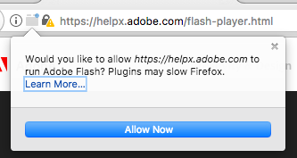

Auto-Flashinator
================

Install Adobe Flash Player directly into firefox.

## Instructions:

1. Download the latest Adobe Flash installer for mac here: https://get.adobe.com/flashplayer/
2. Quit (command-q) out of firefox
3. Run this script and point it to the installation dmg:

```
bash flashinator ~/Downloads/install_flash_player_osx.dmg
```

4. Start firefox
5. Test flash installation here: https://helpx.adobe.com/flash-player.html
    - NOTE: You may have to click "Allow Flash". There's an icon to click inside the URL bar.


